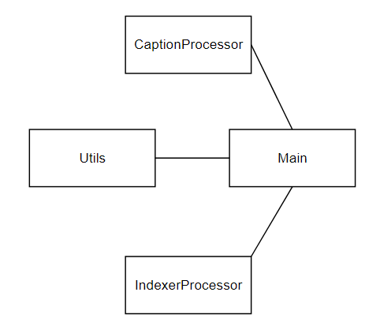

# Video_Caption_Indexer
## Introdução
Esse projeto consiste na construção de um software capaz de recuperar e indexar as Captions de um vídeo do Youtube, permitindo que o usuário realize uma busca pelo conteúdo falado no vídeo. As respostas devem ser ordenadas de acordo com a proximidade das palavras-chave fornecidas pelo usuário. O programa no seu estado atual está funcionando somente para Captions em português.

O projeto consiste das seguintes etapas:
1. Recuperar a caption de um vídeo.
2. Indexar essa caption juntamente com suas timestamps
3. Fornecer uma forma de buscar os resultados ordenados por ordem de relevância.
4. Devolver o Timestamp de cada resultado encontrado para permitir que o usuário o localize suas posições vídeo.

## Ferramentas utilizadas
* O ambiente de desenvolvimento utilizado foi o Anaconda com o **Python 3.9.15**
* O ***Apache Solr 9.1*** foi utilizado dentro de um ambiente Docker para realizar a indexação e as buscas.
* Para extrair as Captions dos vídeos do youtube foi utilizado o pacote ***youtube-transcript-api***
* O pacote **pysolr** foi usado como cliente do Apache Solr na codificação do programa.
## Arquitetura do projeto

  

Foram utilizadas duas classes para a codificação do projeto:
1. A primeira classe se chama **CaptionProcessor** e é responsável pela recuperação e formatação da Caption do youtube, entregando somente as informações que serão indexadas.
2. A segunda classe se chama **IndexProcessor** e é responsável pela manipulação do Apache Solr para realizar indexações e buscas.
3. Um módulo **Utils** foi criado para algumas funções utilitárias como verificações da validade de links do youtube, formatação da resposta para ficar legível pro usuário, formatação do timestamp da resposta.

## Utilização
* Antes de tudo deve-se levantar um servidor de solr, se for utilizado um docker pode-se usar o comando **docker run -d -p 8983:8983 --name [nome qualquer] solr solr-create -c [nome do core do solr]**.
* Para instalar as dependências utilize o comando **pip install -r requirements.txt**
* Para executar os testes deve-se usar o comando **python Tests.py -v** na raiz do projeto.
* Para executar o projeto deve-se usar o comando **python main.py [link do youtube entre aspas] [palavras chaves]**, o link do youtube e as palavras-chave devem estar entre aspas. Ex: **python main.py "https://www.youtube.com/watch?v=3AfjJ2dwfIk" "Palavra Chave"**
